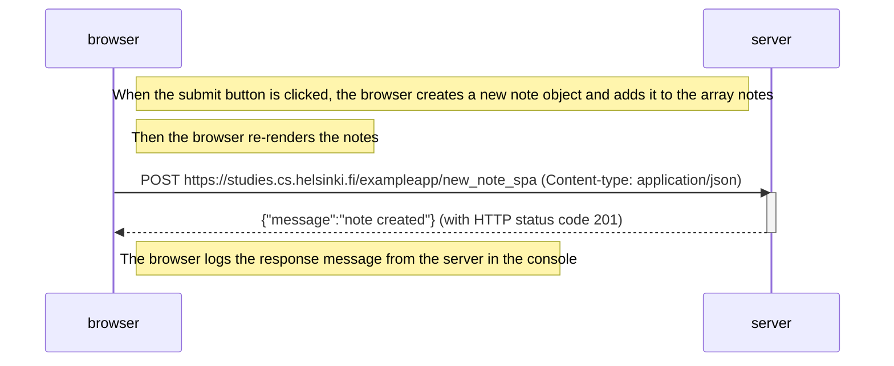

```mermaid
sequenceDiagram
  participant browser
  participant server

  Note right of browser: When the submit button is clicked, the browser creates a new note object and adds it to the array notes

  Note right of browser: Then the browser re-renders the notes

  browser->>server: POST https://studies.cs.helsinki.fi/exampleapp/new_note_spa (Content-type: application/json)
  activate server
  server-->>browser: {"message":"note created"} (with HTTP status code 201)
  deactivate server

  Note right of browser: The browser logs the response message from the server in the console
```
